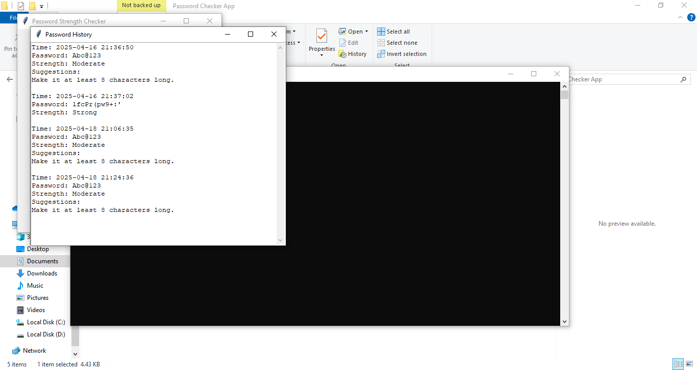

# Password Strength Checker - GUI App

This Python project is a **Password Strength Checker** with a simple **Graphical User Interface (GUI)** built using `Tkinter`.

It allows users to enter a password and get an instant strength evaluation based on various criteria like length, character variety, and presence of common words.

---

## Features

- GUI built with Tkinter
- Password Strength Evaluation:
  - Length Check
  - Uppercase/Lowercase/Numbers/Special Characters
  - Common password detection
- Generates password report in `.txt` and `.csv` formats
- Easy to use for non-technical users

---

## Screenshots

### App Home


### Password Strength Check


### Password Generator


### History Popup



## How to Run

1. Make sure you have **Python 3.x** installed.
2. Install required libraries if needed (optional):
   ```bash
   pip install tk
